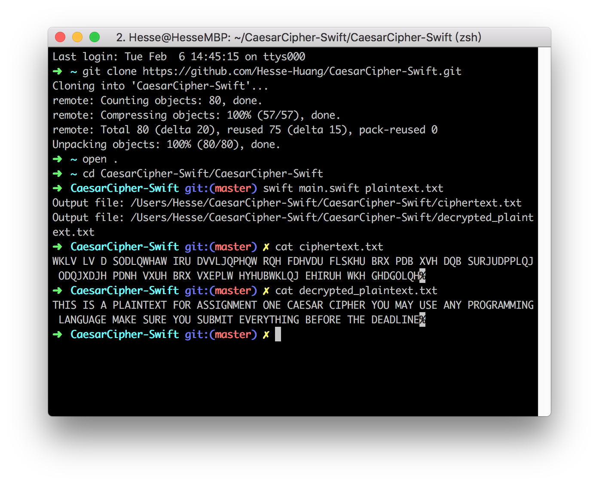

# CaesarCipher-Swift  

## Introduction

My assignment is implemented with Swift the programming language by Apple. 

You may download the source code [here](https://github.com/Hesse-Huang/CaesarCipher-Swift).


## Usage

1. You may need to [download Swift](https://swift.org/download/) before running the program;
2. Run the following commands:


```sh
$ git clone https://github.com/Hesse-Huang/CaesarCipher-Swift.git
$ cd CaesarCipher-Swift/CaesarCipher-Swift
$ swift main.swift plaintext.txt
```

3. Run `$ open .`  to see the output files.


## Specifying KEY

You may also specify a key using option `-k YOUR-KEY`, eg.

```sh
$ swift main.swift -k 5 plaintext.txt
```


## Encryption process

After reading the file as a string, we convert it into a C string, which actually is an Array of 8-bit integer. For each of 8-bit integer, we process the one limited in both range 97 ~ 122 and range 65 ~ 90 (both of bounds included) with the following steps: 

**minus 97(or 65), plus KEY, mod 26, plus 97(or 65)**

Finally, we convert the processed integers back to C string, and export it into "ciphertext.txt".


## Decryption process

Similarly, for the decryption process, we first read the cipher text, and then process those integers by the following steps:

**minus 97 (or 65) , minus KEY, plus 26 if negative, mod 26, plus 97 (or 65) **

And exporting the converted string into "decrypted_plaintext.txt".


## Snapshots 

